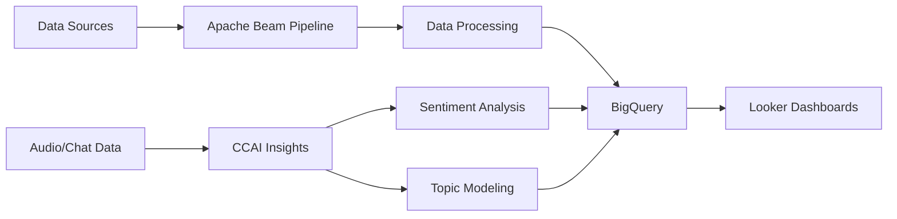

- 👋 Hi, I’m @ankitmohanpandey
- 👀 I’m interested in Dataops
  

<h1 align="center">
  
</h1>

<p align="center">
  
  
</p>

<p align="center">
  
</p>

## 🚀 About Me

```python
class DataEngineer:
    def __init__(self):
        self.name = "Your Name"
        self.role = "Data Engineer"
        self.location = "India 🇮🇳"
        self.current_focus = ["Apache Beam", "Apache Spark", "GCP CCAI Insights"]
        self.learning = ["Big Data", "Cloud Technologies", "ML Pipelines"]
        
    def say_hi(self):
        print("Thanks for dropping by! Let's build something amazing together!")

me = DataEngineer()
me.say_hi()
```


### 💼 What I Do
- 🔧 Building scalable data pipelines
- ☁️ Working with GCP services
- 📊 Processing big data with Spark & Beam
- 🤖 Exploring ML/AI integrations
- 📈 Creating data-driven solutions

### 🌱 Currently Learning
- **Apache Beam** - Distributed data processing
- **Apache Spark** - Big data analytics & ML
- **GCP CCAI Insights** - Contact center AI analytics
- **Airflow** - Workflow orchestration

<br clear="right"/>

## 🛠️ Tech Stack

<p align="center">
  
</p>

### Languages & Frameworks


### Big Data & Processing


### Cloud & Tools


### Data & Visualization


## 📊 GitHub Stats

<p align="center">
  
  
</p>

<p align="center">
  
</p>

## 🎯 Current Projects

<table>
  <tr>
    <td width="50%">
      <h3 align="center">📚 Learning Resources</h3>
      <p align="center">
        <a href="https://github.com/yourusername/learning" target="_blank">
          
        </a>
      </p>
      <p>Comprehensive learning resources for Apache Beam, Spark, and GCP CCAI Insights with detailed examples and documentation.</p>
    </td>
    <td width="50%">
      <h3 align="center">⚡ Data Pipelines</h3>
      <p align="center">
        <a href="https://github.com/yourusername/pipelines" target="_blank">
          
        </a>
      </p>
      <p>Production-ready data pipelines using Apache Beam and Spark for ETL and real-time processing.</p>
    </td>
  </tr>
</table>

## 📈 Contribution Graph

<p align="center">
  
</p>

## 🏆 GitHub Trophies

<p align="center">
  
</p>

## 💡 Random Dev Quote

<p align="center">
  
</p>

## 🔥 What I'm Working On



## 📫 Connect With Me

<p align="center">
  <a href="https://linkedin.com/in/yourprofile">
    
  </a>
  <a href="https://twitter.com/yourhandle">
    
  </a>
  <a href="mailto:your.email@example.com">
    
  </a>
  <a href="https://github.com/yourusername">
    
  </a>
</p>

## 💻 Workspace Setup

```javascript
const workspace = {
  os: "macOS",
  editor: "VS Code / Windsurf",
  terminal: "zsh",
  tools: ["Git", "Docker", "gcloud CLI"],
  currentlyLearning: ["Apache Beam", "Apache Spark", "GCP CCAI Insights"],
  funFact: "I document everything I learn for my future self!"
};
```

## 📚 Latest Blog Posts
<!-- BLOG-POST-LIST:START -->
- 🔥 Building Scalable Data Pipelines with Apache Beam
- ☁️ GCP Contact Center AI Insights - Complete Guide
- ⚡ Apache Spark for Big Data Processing
- 🚀 Real-time Data Processing Best Practices
<!-- BLOG-POST-LIST:END -->

## 🎨 Skills Visualization

<p align="center">
  
</p>

---

<p align="center">
  
</p>

<p align="center">
  
</p>

<p align="center">
  Made with ❤️ and lots of ☕
</p>

